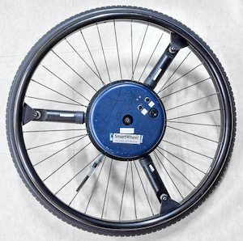

pushrimkinetics
===============

Provide functions to process kinetic data from instrumented wheelchair wheels such as the SmartWheel, pictured below.

The functions provided by this module are:

- `read_smartwheel(filename)`: Read a file generated by the SmartWheel instrumented wheel.
- `apply_calibration(ts, gains, offsets, *, transducer, reference_frame)`: Calculate pushrim forces and moments based on raw channel values.
- `remove_offsets(ts, baseline_kinetics)`: Remove dynamic offsets in forces and moments.
- `calculate_velocity(ts)`: Calculate velocity based on wheel angle.
- `calculate_power(ts)`: Calculate power based on wheel velocity and moment.

Please consult the [tutorial](tutorial.ipynb) for more information.
